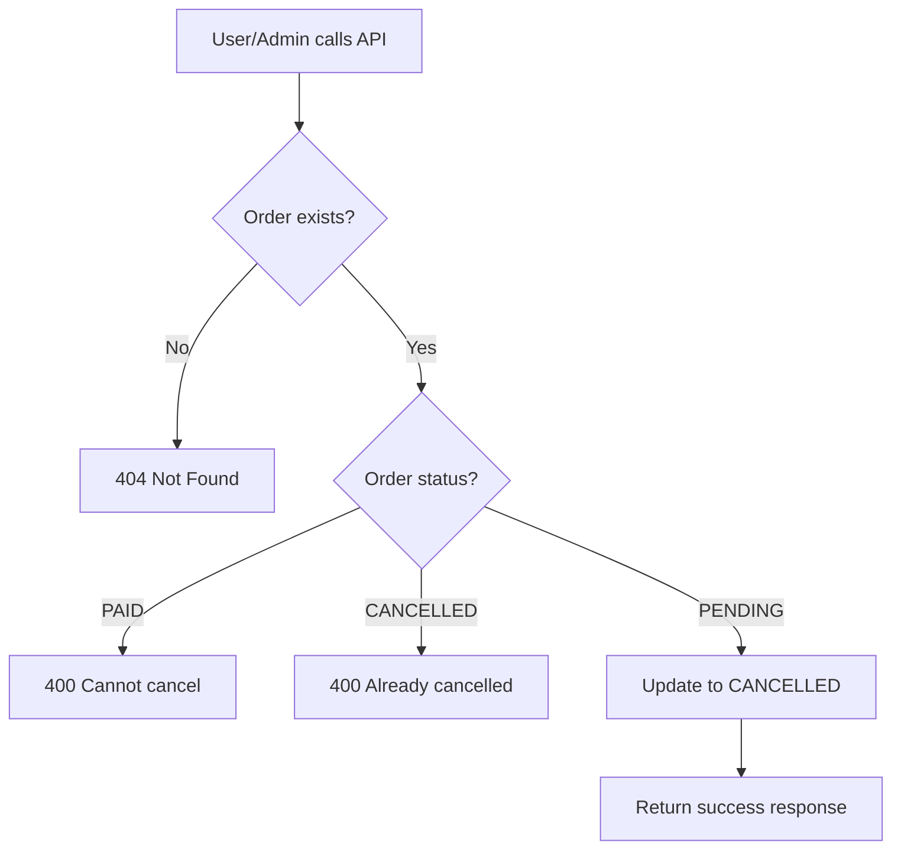

# Cancel Payment Implementation Summary

## 📌 Problem
PayOS không hỗ trợ webhook để tự động hủy thanh toán và cập nhật order status.

## ✅ Solution
Tạo manual cancel API endpoint cho phép hủy thanh toán thủ công.

---

## 🚀 Implementation

### 1. Controller (`payment.controller.ts`)
```typescript
export const cancelPaymentController = async (req: Request, res: Response)
```

**Chức năng:**
- Nhận `orderCode` từ URL parameter
- Kiểm tra order tồn tại
- Kiểm tra order có thể hủy (không phải PAID/CANCELLED)
- Cập nhật status = 'CANCELLED', tracking = 'FAILED'
- Trả về thông tin order đã hủy

**Validation:**
- ❌ Cannot cancel PAID orders
- ❌ Cannot cancel already CANCELLED orders
- ✅ Can cancel PENDING orders

### 2. Route (`payment.route.ts`)
```typescript
POST /api/payment/cancel/:orderCode
```

**Features:**
- No authentication required (có thể thêm nếu cần)
- Complete Swagger documentation
- Path parameter validation

---

## 📁 Files Created/Modified

### Modified Files
1. ✅ `src/controllers/payment.controller.ts`
   - Added `cancelPaymentController` function (70 lines)

2. ✅ `src/routes/payment.route.ts`
   - Added import for `cancelPaymentController`
   - Added route with full Swagger docs (80 lines)

### New Files
1. ✅ `test-cancel-payment.ps1`
   - PowerShell test script

2. ✅ `CANCEL_PAYMENT_API.md`
   - Complete API documentation
   - Examples for all platforms
   - Integration guides
   - Testing instructions

3. ✅ `CANCEL_PAYMENT_SUMMARY.md` (this file)
   - Quick reference guide

### Updated Files
1. ✅ `PAYOS_WEBHOOK_TROUBLESHOOTING.md`
   - Added link to cancel API as alternative solution

---

## 🧪 Testing

### Quick Test
```powershell
.\test-cancel-payment.ps1
# Enter order code when prompted
```

### Manual Test
```bash
curl -X POST http://localhost:3000/api/payment/cancel/123456
```

### Expected Response
```json
{
  "success": true,
  "message": "Payment cancelled successfully",
  "data": {
    "orderCode": "123456",
    "orderType": "topup",
    "previousStatus": "PENDING",
    "newStatus": "CANCELLED",
    "tracking": "FAILED"
  }
}
```

---

## 📊 Database Impact

### Query Executed
```sql
UPDATE orders 
SET 
  status = 'CANCELLED', 
  tracking = 'FAILED', 
  updated_at = NOW() 
WHERE code = ?
```

### Fields Updated
- `status`: → 'CANCELLED'
- `tracking`: → 'FAILED'
- `updated_at`: → NOW()

---

## 🔄 Workflow



---

## 💡 Use Cases

### 1. User Cancels Payment
```
User creates payment → User changes mind → Call cancel API → Order cancelled
```

### 2. Payment Timeout
```
Payment link expires → System/Admin calls cancel API → Clean up pending order
```

### 3. Admin Management
```
Admin views pending orders → Admin clicks cancel → API called → Order cancelled
```

---

## 🎯 Frontend Integration

### React Example
```typescript
const handleCancelPayment = async (orderCode: string) => {
  const response = await fetch(
    `/api/payment/cancel/${orderCode}`,
    { method: 'POST' }
  );
  const data = await response.json();
  
  if (data.success) {
    toast.success('Payment cancelled');
    refreshOrders();
  }
};
```

### Button Component
```tsx
<button 
  onClick={() => handleCancelPayment(order.code)}
  disabled={order.status !== 'PENDING'}
>
  Cancel Payment
</button>
```

---

## 🔒 Security Considerations

### Current Implementation
- ✅ No authentication (anyone can cancel with order code)
- ✅ Validates order status before cancelling
- ✅ Prevents cancelling paid orders

### Recommended Improvements
```typescript
// Add authentication
router.post('/cancel/:orderCode', authenticateToken, cancelPaymentController);

// Add authorization (only order owner or admin)
if (order.buyer_id !== userId && !isAdmin) {
  return res.status(403).json({ message: 'Forbidden' });
}
```

---

## 📈 Monitoring

### Logs to Watch
```
✅ Order {orderCode} manually cancelled (type: {type})
❌ Error cancelling payment: {error}
```

### Metrics to Track
- Number of cancelled payments per day
- Cancellation reasons (if implemented)
- Time between order creation and cancellation
- User who cancelled (if auth added)

---

## 🔮 Future Enhancements

### Possible Additions
1. **Cancellation Reason Field**
   ```typescript
   { reason: "User requested", cancelled_by: userId }
   ```

2. **Batch Cancellation**
   ```typescript
   POST /api/payment/cancel-batch
   { orderCodes: ["123", "456", "789"] }
   ```

3. **Automatic Expiration**
   ```typescript
   // Cron job to cancel expired orders
   SELECT * FROM orders 
   WHERE status = 'PENDING' 
   AND created_at < NOW() - INTERVAL 24 HOUR
   ```

4. **Notification System**
   ```typescript
   // Send notification when order cancelled
   await sendNotification(order.buyer_id, {
     type: 'ORDER_CANCELLED',
     orderId: order.id
   });
   ```

5. **Refund Integration** (if partial payment made)
   ```typescript
   if (order.partial_paid) {
     await processRefund(order.id);
   }
   ```

---

## ✅ Checklist

### Implementation
- [x] Create controller function
- [x] Add route with Swagger docs
- [x] Create test script
- [x] Write documentation
- [x] Test with sample data

### Before Production
- [ ] Add authentication if needed
- [ ] Add authorization checks
- [ ] Add rate limiting
- [ ] Add detailed logging
- [ ] Add monitoring/alerts
- [ ] Update frontend to use API
- [ ] Test all edge cases
- [ ] Review security implications

---

## 📚 Related Documentation
- `CANCEL_PAYMENT_API.md` - Complete API documentation
- `PAYOS_WEBHOOK_TROUBLESHOOTING.md` - Webhook troubleshooting
- `test-cancel-payment.ps1` - Test script

---

## 🆘 Troubleshooting

### Issue: Order not found
**Solution**: Verify order code exists in database
```sql
SELECT * FROM orders WHERE code = '123456';
```

### Issue: Cannot cancel paid order
**Solution**: This is expected behavior - paid orders cannot be cancelled

### Issue: API returns 500 error
**Solution**: Check server logs for detailed error message

---

## 📞 Contact
For questions or issues, contact the development team.
