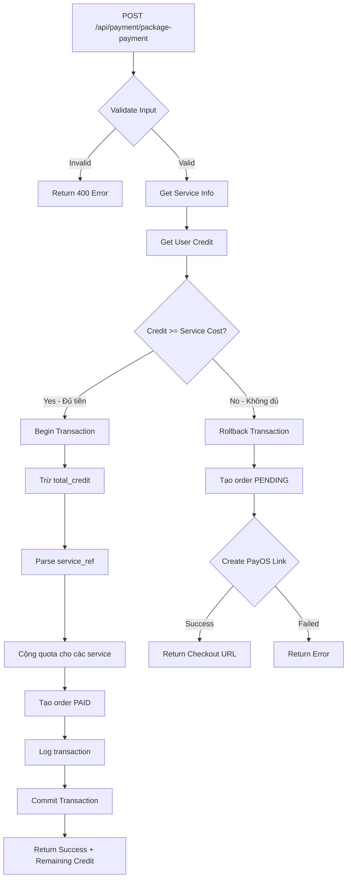

# Package Payment API Documentation

## 📦 API: Package Payment với Credit Check

**Endpoint:** `POST /api/payment/package-payment`

**Mô tả:** API này xử lý thanh toán package/gói dịch vụ. Hệ thống sẽ kiểm tra `total_credit` của user:
- ✅ **Nếu đủ tiền:** Trừ credit → Cộng quota → Trả về kết quả thành công
- ❌ **Nếu không đủ:** Tạo link PayOS → Trả về checkout URL

---

## 🔑 Request

### Headers
```
Content-Type: application/json
```

### Body Parameters
| Parameter | Type | Required | Description |
|-----------|------|----------|-------------|
| `user_id` | number | ✅ Yes | ID của user cần thanh toán |
| `service_id` | number | ✅ Yes | ID của service/package (từ bảng `services`) |

### Request Example
```json
{
  "user_id": 1,
  "service_id": 7
}
```

---

## 📤 Response

### Case 1: ✅ Đủ Credit - Thanh toán thành công

**HTTP Status:** `200 OK`

```json
{
  "success": true,
  "message": "Thanh toán thành công! Đã trừ 100000 VND từ tài khoản. Bạn nhận được 3 lượt đăng bài.",
  "data": {
    "remainingCredit": 50000,
    "quotaAdded": 3
  }
}
```

**Giải thích:**
- `remainingCredit`: Số credit còn lại sau khi trừ
- `quotaAdded`: Số lượng quota được cộng (từ `number_of_post` trong bảng `services`)

---

### Case 2: ❌ Không đủ Credit - Cần thanh toán PayOS

**HTTP Status:** `200 OK`

```json
{
  "success": false,
  "needPayment": true,
  "message": "Số dư không đủ (20000 VND). Cần thanh toán 100000 VND.",
  "data": {
    "checkoutUrl": "https://pay.payos.vn/web/d7a3e96afcc8477fb22a7ec0bc43c8ba",
    "orderCode": 456789,
    "remainingCredit": 20000
  }
}
```

**Giải thích:**
- `checkoutUrl`: Link PayOS để user thanh toán
- `orderCode`: Mã order đã được tạo trong database với status `PENDING`
- `remainingCredit`: Số credit hiện tại của user

---

### Case 3: ⚠️ Lỗi Validation

**HTTP Status:** `400 Bad Request`

```json
{
  "success": false,
  "message": "Missing required fields: user_id, service_id"
}
```

hoặc

```json
{
  "success": false,
  "message": "user_id and service_id must be numbers"
}
```

hoặc

```json
{
  "success": false,
  "message": "Dịch vụ không tồn tại"
}
```

---

### Case 4: ❌ Server Error

**HTTP Status:** `500 Internal Server Error`

```json
{
  "success": false,
  "message": "Xử lý thanh toán package thất bại"
}
```

---

## 🔄 Business Logic Flow



---

## 💾 Database Changes

### Khi đủ credit (Case 1):

1. **Table `users`:**
   ```sql
   UPDATE users 
   SET total_credit = total_credit - service_cost 
   WHERE id = user_id;
   ```

2. **Table `user_quota`:**
   ```sql
   -- Cho mỗi service_id trong service_ref (e.g., "1,3")
   UPDATE user_quota 
   SET amount = amount + number_of_post 
   WHERE user_id = ? AND service_id = ?;
   
   -- Hoặc INSERT nếu chưa có
   INSERT INTO user_quota (user_id, service_id, amount) 
   VALUES (?, ?, number_of_post);
   ```

3. **Table `orders`:**
   ```sql
   INSERT INTO orders 
   (code, type, service_id, buyer_id, price, status, payment_method, created_at) 
   VALUES (orderCode, 'package', serviceId, userId, cost, 'PAID', 'CREDIT', NOW());
   ```

4. **Table `transaction_detail`:**
   ```sql
   INSERT INTO transaction_detail 
   (order_id, user_id, unit, type, credits) 
   VALUES (orderId, userId, 'CREDIT', 'Decrease', cost);
   ```

### Khi không đủ credit (Case 2):

1. **Table `orders`:**
   ```sql
   INSERT INTO orders 
   (code, type, service_id, buyer_id, price, status, payment_method, created_at) 
   VALUES (orderCode, 'package', serviceId, userId, cost, 'PENDING', 'PAYOS', NOW());
   ```

2. **PayOS API:** Tạo payment link với `orderCode`

---

## 📊 Example Services Data

Từ bảng `services`:

| ID | Name | Type | Cost | number_of_post | service_ref | product_type |
|----|------|------|------|----------------|-------------|--------------|
| 7 | Gói Pro | package | 100000 | 3 | 1,3 | vehicle |
| 8 | Gói Enterprise | package | 300000 | 5 | 1,3 | vehicle |
| 9 | Gói Pro | package | 100000 | 3 | 2,4 | battery |
| 10 | Gói Enterprise | package | 300000 | 5 | 2,4 | battery |

**`service_ref` giải thích:**
- `"1,3"` = Service ID 1 (Đăng post vehicle) + Service ID 3 (Đẩy post vehicle)
- `"2,4"` = Service ID 2 (Đăng post battery) + Service ID 4 (Đẩy post battery)

Khi mua package, quota sẽ được cộng cho **TẤT CẢ** các service trong `service_ref`.

---

## 🧪 Testing Examples

### Test 1: User có đủ credit

**Setup:**
```sql
-- User có 150,000 VND credit
UPDATE users SET total_credit = 150000 WHERE id = 1;

-- Package Pro cost 100,000 VND, cho 3 quota
SELECT * FROM services WHERE id = 7;
```

**Request:**
```bash
curl -X POST http://localhost:3000/api/payment/package-payment \
  -H "Content-Type: application/json" \
  -d '{
    "user_id": 1,
    "service_id": 7
  }'
```

**Expected Response:**
```json
{
  "success": true,
  "message": "Thanh toán thành công! Đã trừ 100000 VND từ tài khoản. Bạn nhận được 3 lượt đăng bài.",
  "data": {
    "remainingCredit": 50000,
    "quotaAdded": 3
  }
}
```

**Verify:**
```sql
-- Check user credit
SELECT total_credit FROM users WHERE id = 1; -- Should be 50000

-- Check quota
SELECT * FROM user_quota WHERE user_id = 1 AND service_id IN (1, 3);
-- Both should have amount = 3

-- Check order
SELECT * FROM orders WHERE buyer_id = 1 ORDER BY created_at DESC LIMIT 1;
-- status should be 'PAID', payment_method 'CREDIT'
```

---

### Test 2: User không đủ credit

**Setup:**
```sql
-- User chỉ có 50,000 VND credit
UPDATE users SET total_credit = 50000 WHERE id = 1;
```

**Request:**
```bash
curl -X POST http://localhost:3000/api/payment/package-payment \
  -H "Content-Type: application/json" \
  -d '{
    "user_id": 1,
    "service_id": 7
  }'
```

**Expected Response:**
```json
{
  "success": false,
  "needPayment": true,
  "message": "Số dư không đủ (50000 VND). Cần thanh toán 100000 VND.",
  "data": {
    "checkoutUrl": "https://pay.payos.vn/web/...",
    "orderCode": 123456,
    "remainingCredit": 50000
  }
}
```

**Verify:**
```sql
-- Check order created with PENDING status
SELECT * FROM orders WHERE buyer_id = 1 ORDER BY created_at DESC LIMIT 1;
-- status should be 'PENDING', payment_method 'PAYOS'

-- Credit should NOT be deducted
SELECT total_credit FROM users WHERE id = 1; -- Still 50000
```

---

## 🔗 Integration with Frontend

### React/Vue Example:

```typescript
async function purchasePackage(userId: number, serviceId: number) {
  try {
    const response = await fetch('/api/payment/package-payment', {
      method: 'POST',
      headers: {
        'Content-Type': 'application/json',
      },
      body: JSON.stringify({
        user_id: userId,
        service_id: serviceId,
      }),
    });

    const result = await response.json();

    if (result.success) {
      // ✅ Thanh toán thành công bằng credit
      alert(result.message);
      console.log('Remaining credit:', result.data.remainingCredit);
      console.log('Quota added:', result.data.quotaAdded);
      // Refresh user profile or quota display
    } else if (result.needPayment) {
      // ❌ Cần thanh toán qua PayOS
      alert(result.message);
      // Redirect to PayOS checkout
      window.location.href = result.data.checkoutUrl;
    } else {
      // ⚠️ Other errors
      alert(result.message);
    }
  } catch (error) {
    console.error('Package payment error:', error);
    alert('Có lỗi xảy ra khi xử lý thanh toán');
  }
}
```

---

## 🔐 Security Considerations

1. **Authentication:** API này nên có middleware `authenticateToken` để verify user
2. **Authorization:** Nên check `user_id` trong token có match với `user_id` trong body không
3. **Rate Limiting:** Prevent spam requests
4. **Transaction Safety:** Sử dụng database transaction để đảm bảo data consistency

### Recommended Route Update:
```typescript
router.post('/package-payment', authenticateToken, packagePaymentController);
```

### Controller Update để check authorization:
```typescript
export const packagePaymentController = async (req: Request, res: Response) => {
  try {
    const { user_id, service_id } = req.body;
    const tokenUserId = (req as any).user?.id; // From authenticateToken middleware
    
    // Check authorization
    if (tokenUserId !== user_id) {
      return res.status(403).json({
        success: false,
        message: 'Unauthorized: Cannot pay for another user',
      });
    }
    
    // ... rest of the code
  } catch (error: any) {
    // ... error handling
  }
};
```

---

## 📝 Notes

1. **Service Ref:** Package sẽ cộng quota cho TẤT CẢ các service trong `service_ref` (ví dụ: "1,3" sẽ cộng quota cho service 1 và 3)

2. **Transaction Safety:** Tất cả database operations đều được wrap trong transaction để đảm bảo atomicity

3. **PayOS Webhook:** Sau khi user thanh toán qua PayOS, webhook sẽ trigger và xử lý logic cộng quota tương tự

4. **Order Type:** Orders có field `type` = 'package' để phân biệt với 'post', 'push', 'verify'

5. **Credit vs PayOS:**
   - Credit: Instant, không qua bên thứ 3
   - PayOS: User phải redirect và thanh toán, sau đó webhook xử lý

---

## 🐛 Troubleshooting

### Issue: "Dịch vụ không tồn tại"
- **Cause:** `service_id` không tồn tại trong bảng `services`
- **Solution:** Check `SELECT * FROM services WHERE id = ?`

### Issue: "User không tồn tại"
- **Cause:** `user_id` không tồn tại trong bảng `users`
- **Solution:** Check `SELECT * FROM users WHERE id = ?`

### Issue: PayOS error khi tạo link
- **Cause:** 
  - Sai API key/checksum key
  - PayOS service down
  - Network error
- **Solution:** 
  - Check `.env` có đủ: `PAYOS_API_KEY`, `PAYOS_CHECKSUM_KEY`, `PAYOS_CLIENT_ID`
  - Check PayOS dashboard status
  - Check console log cho chi tiết error

### Issue: Quota không được cộng
- **Cause:** Transaction rollback do lỗi ở giữa chừng
- **Solution:** 
  - Check console log
  - Verify `service_ref` format đúng (e.g., "1,3")
  - Check `number_of_post` có giá trị hợp lệ

---

## ✅ Success Checklist

- [ ] API endpoint `/api/payment/package-payment` hoạt động
- [ ] Validate input (user_id, service_id required và phải là số)
- [ ] Check user credit đủ/không đủ chính xác
- [ ] Trừ credit và cộng quota đúng khi đủ tiền
- [ ] Tạo PayOS link đúng khi không đủ tiền
- [ ] Order được tạo với status đúng (PAID/PENDING)
- [ ] Transaction rollback khi có lỗi
- [ ] Response format chuẩn cho frontend
- [ ] Error handling đầy đủ
- [ ] Swagger documentation

---

## 🎯 Future Enhancements

1. **Add Authentication:** `authenticateToken` middleware
2. **Add Authorization:** Check token user_id === body user_id
3. **Add Rate Limiting:** Prevent abuse
4. **Add Email Notification:** Gửi email khi mua package thành công
5. **Add Refund Logic:** Xử lý hoàn tiền nếu cần
6. **Add Package History:** API để xem lịch sử mua package
7. **Add Quota Expiry:** Package có thời hạn sử dụng

---

Chúc bạn triển khai thành công! 🚀
