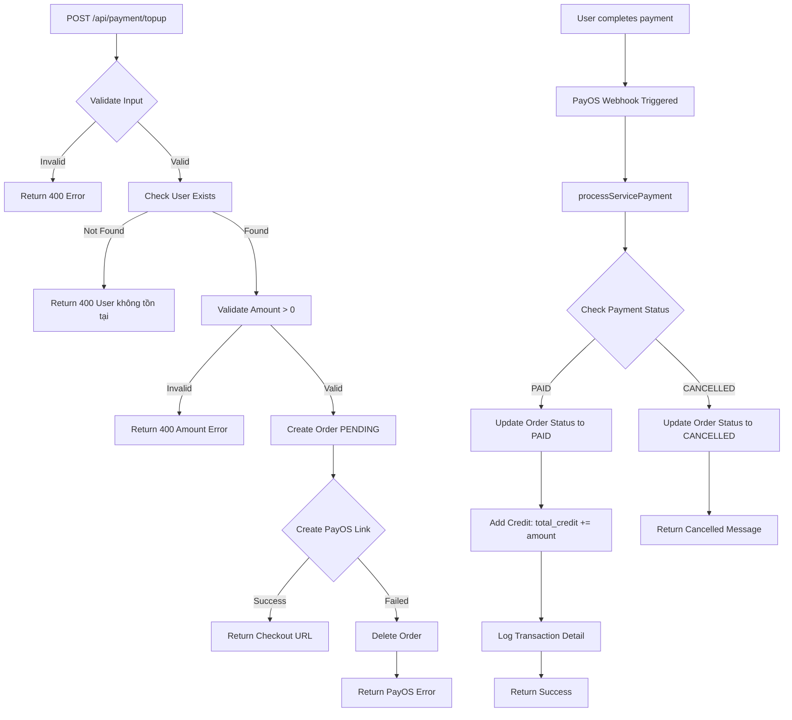

# Top Up Payment API Documentation

## 💰 API: Top Up Payment - Nạp Tiền Vào Tài Khoản

**Endpoint:** `POST /api/payment/topup`

**Mô tả:** API này cho phép user nạp tiền vào tài khoản `total_credit`. Hệ thống sẽ:
1. Tạo order với status `PENDING` và type `topup`
2. Tạo link thanh toán PayOS
3. Sau khi thanh toán thành công (webhook), cộng tiền vào `total_credit`

---

## 🔑 Request

### Headers
```
Content-Type: application/json
```

### Body Parameters
| Parameter | Type | Required | Description |
|-----------|------|----------|-------------|
| `user_id` | number | ✅ Yes | ID của user cần nạp tiền |
| `amount` | number | ✅ Yes | Số tiền cần nạp (VND) |
| `description` | string | ❌ No | Mô tả giao dịch (tùy chọn) |

### Request Example
```json
{
  "user_id": 1,
  "amount": 100000,
  "description": "Nạp tiền vào tài khoản"
}
```

---

## 📤 Response

### Case 1: ✅ Tạo link thanh toán thành công

**HTTP Status:** `200 OK`

```json
{
  "success": true,
  "message": "Đã tạo link thanh toán nạp 100000 VND",
  "data": {
    "checkoutUrl": "https://pay.payos.vn/web/d7a3e96afcc8477fb22a7ec0bc43c8ba",
    "orderCode": 456789,
    "amount": 100000
  }
}
```

**Giải thích:**
- `checkoutUrl`: Link PayOS để user thanh toán (redirect đến đây)
- `orderCode`: Mã order đã được tạo trong database với status `PENDING`
- `amount`: Số tiền nạp (VND)

---

### Case 2: ⚠️ Lỗi Validation

**HTTP Status:** `400 Bad Request`

**Missing fields:**
```json
{
  "success": false,
  "message": "Missing required fields: user_id, amount"
}
```

**Invalid type:**
```json
{
  "success": false,
  "message": "user_id and amount must be numbers"
}
```

**Invalid amount:**
```json
{
  "success": false,
  "message": "Amount must be greater than 0"
}
```

**User not found:**
```json
{
  "success": false,
  "message": "User không tồn tại"
}
```

**Invalid amount value:**
```json
{
  "success": false,
  "message": "Số tiền nạp không hợp lệ. Vui lòng nhập số tiền lớn hơn 0."
}
```

---

### Case 3: ❌ PayOS Error

**HTTP Status:** `400 Bad Request`

```json
{
  "success": false,
  "message": "Lỗi tạo link thanh toán: [PayOS error message]"
}
```

**Note:** Nếu PayOS fail, order đã tạo sẽ bị xóa tự động.

---

### Case 4: ❌ Server Error

**HTTP Status:** `500 Internal Server Error`

```json
{
  "success": false,
  "message": "Xử lý nạp tiền thất bại"
}
```

---

## 🔄 Business Logic Flow



---

## 💾 Database Changes

### 1. Khi tạo link thanh toán:

**Table `orders`:**
```sql
INSERT INTO orders 
(code, type, service_id, buyer_id, price, status, payment_method, created_at) 
VALUES 
(456789, 'topup', NULL, 1, 100000, 'PENDING', 'PAYOS', NOW());
```

**Note:** 
- `type` = `'topup'` để phân biệt với 'post', 'package', 'push', 'verify'
- `service_id` = `NULL` vì đây là nạp tiền, không liên quan đến service cụ thể

---

### 2. Sau khi webhook xác nhận thanh toán thành công:

**Table `orders`:**
```sql
UPDATE orders 
SET status = 'PAID' 
WHERE code = 456789;
```

**Table `users`:**
```sql
UPDATE users 
SET total_credit = total_credit + 100000 
WHERE id = 1;
```

**Table `transaction_detail`:**
```sql
INSERT INTO transaction_detail 
(order_id, user_id, unit, type, credits) 
VALUES 
(123, 1, 'CREDIT', 'Increase', 100000);
```

---

## 🔗 Integration với Webhook

Sau khi user thanh toán thành công trên PayOS, webhook sẽ trigger:

**Webhook Endpoint:** `POST /api/payment/payos-webhook`

**Webhook payload từ PayOS:**
```json
{
  "code": "00",
  "desc": "success",
  "success": true,
  "data": {
    "orderCode": 456789,
    "amount": 100000,
    "description": "Nap tien tai khoan 456789",
    "accountNumber": "0837773347",
    "reference": "FT25286107625453",
    "transactionDateTime": "2025-10-20 18:22:39",
    "currency": "VND",
    "paymentLinkId": "3cb33cf615c7470291f49649fdff6f25",
    "code": "00",
    "desc": "success"
  }
}
```

**Webhook xử lý:**
1. Lấy `orderCode` từ payload
2. Gọi `processServicePayment(orderCode)`
3. Hàm này sẽ:
   - Check payment status từ PayOS
   - Update order status thành `PAID`
   - Cộng tiền vào `total_credit`
   - Log transaction detail
   - Return success message

---

## 🧪 Testing Examples

### Test 1: Nạp tiền thành công

**Setup:**
```sql
-- User exists
SELECT * FROM users WHERE id = 1;
-- total_credit hiện tại: 50000
```

**Request:**
```bash
curl -X POST http://localhost:3000/api/payment/topup \
  -H "Content-Type: application/json" \
  -d '{
    "user_id": 1,
    "amount": 100000,
    "description": "Nạp tiền test"
  }'
```

**Expected Response:**
```json
{
  "success": true,
  "message": "Đã tạo link thanh toán nạp 100000 VND",
  "data": {
    "checkoutUrl": "https://pay.payos.vn/web/...",
    "orderCode": 456789,
    "amount": 100000
  }
}
```

**Verify Order Created:**
```sql
SELECT * FROM orders WHERE code = 456789;
-- Expected: status = 'PENDING', type = 'topup', price = 100000
```

**Simulate Payment Success (webhook):**
```bash
curl -X POST http://localhost:3000/api/payment/payos-webhook \
  -H "Content-Type: application/json" \
  -d '{
    "code": "00",
    "desc": "success",
    "success": true,
    "data": {
      "orderCode": 456789,
      "amount": 100000,
      "status": "PAID"
    }
  }'
```

**Verify Final State:**
```sql
-- Check order updated
SELECT * FROM orders WHERE code = 456789;
-- Expected: status = 'PAID'

-- Check credit added
SELECT total_credit FROM users WHERE id = 1;
-- Expected: 150000 (50000 + 100000)

-- Check transaction log
SELECT * FROM transaction_detail WHERE order_id = (
  SELECT id FROM orders WHERE code = 456789
);
-- Expected: type = 'Increase', credits = 100000
```

---

### Test 2: User không tồn tại

**Request:**
```bash
curl -X POST http://localhost:3000/api/payment/topup \
  -H "Content-Type: application/json" \
  -d '{
    "user_id": 99999,
    "amount": 100000
  }'
```

**Expected Response:**
```json
{
  "success": false,
  "message": "User không tồn tại"
}
```

---

### Test 3: Amount invalid

**Request 1 - Negative:**
```bash
curl -X POST http://localhost:3000/api/payment/topup \
  -H "Content-Type: application/json" \
  -d '{
    "user_id": 1,
    "amount": -50000
  }'
```

**Expected Response:**
```json
{
  "success": false,
  "message": "Amount must be greater than 0"
}
```

**Request 2 - Zero:**
```bash
curl -X POST http://localhost:3000/api/payment/topup \
  -H "Content-Type: application/json" \
  -d '{
    "user_id": 1,
    "amount": 0
  }'
```

**Expected Response:**
```json
{
  "success": false,
  "message": "Amount must be greater than 0"
}
```

---

### Test 4: Missing required fields

**Request:**
```bash
curl -X POST http://localhost:3000/api/payment/topup \
  -H "Content-Type: application/json" \
  -d '{
    "user_id": 1
  }'
```

**Expected Response:**
```json
{
  "success": false,
  "message": "Missing required fields: user_id, amount"
}
```

---

## 🔗 Integration with Frontend

### React/Vue Example:

```typescript
async function topUpCredit(userId: number, amount: number, description?: string) {
  try {
    const response = await fetch('/api/payment/topup', {
      method: 'POST',
      headers: {
        'Content-Type': 'application/json',
      },
      body: JSON.stringify({
        user_id: userId,
        amount: amount,
        description: description || `Nạp ${amount} VND`,
      }),
    });

    const result = await response.json();

    if (result.success) {
      // ✅ Link thanh toán đã tạo
      console.log('Order code:', result.data.orderCode);
      console.log('Amount:', result.data.amount);
      
      // Redirect to PayOS checkout
      window.location.href = result.data.checkoutUrl;
    } else {
      // ❌ Error
      alert(result.message);
    }
  } catch (error) {
    console.error('Top up error:', error);
    alert('Có lỗi xảy ra khi nạp tiền');
  }
}

// Usage
topUpCredit(1, 100000, 'Nạp tiền vào tài khoản');
```

### Payment Success Page:

Sau khi user thanh toán xong, PayOS sẽ redirect về:
```
http://localhost:3000/payment/result?provider=payos&next=/profile?tab=wallet
```

Frontend cần xử lý:
```typescript
// Check URL params
const urlParams = new URLSearchParams(window.location.search);
const provider = urlParams.get('provider');
const nextPage = urlParams.get('next');

if (provider === 'payos') {
  // Show success message
  showToast('Nạp tiền thành công! Vui lòng đợi vài giây để cập nhật số dư.');
  
  // Wait for webhook to process (2-3 seconds)
  setTimeout(() => {
    // Refresh user data
    fetchUserProfile();
    
    // Redirect to next page
    if (nextPage) {
      window.location.href = nextPage;
    }
  }, 3000);
}
```

---

## 📊 Order Type Summary

Hiện tại hệ thống support các loại order:

| Type | Description | Service ID | Credit Flow |
|------|-------------|------------|-------------|
| `post` | Đăng bài post | Required | Credit → Quota |
| `push` | Đẩy bài post | Required | Credit → Quota |
| `verify` | Xác minh | Required | Credit → Quota |
| `package` | Mua gói dịch vụ | Required | Credit → Quota (multiple services) |
| `topup` | Nạp tiền | NULL | PayOS → Credit |

**Flow so sánh:**

**Package/Post/Push/Verify:**
1. User có credit → Trừ credit → Cộng quota
2. User không đủ credit → Tạo PayOS link → User thanh toán → Cộng credit → (Cộng quota nếu cần)

**Topup:**
1. Tạo PayOS link ngay → User thanh toán → Cộng credit (không cần quota)

---

## 🔐 Security Considerations

1. **Authentication:** Nên thêm middleware `authenticateToken`
   ```typescript
   router.post('/topup', authenticateToken, topUpPaymentController);
   ```

2. **Authorization:** Check user_id trong token có match với body
   ```typescript
   const tokenUserId = (req as any).user?.id;
   if (tokenUserId !== user_id) {
     return res.status(403).json({
       success: false,
       message: 'Unauthorized: Cannot top up for another user',
     });
   }
   ```

3. **Rate Limiting:** Giới hạn số lần nạp tiền trong 1 khoảng thời gian

4. **Amount Validation:** 
   - Min amount: 10,000 VND
   - Max amount: 50,000,000 VND
   ```typescript
   if (amount < 10000 || amount > 50000000) {
     return res.status(400).json({
       success: false,
       message: 'Số tiền phải từ 10,000 đến 50,000,000 VND',
     });
   }
   ```

5. **Webhook Security:** Verify PayOS signature
   ```typescript
   const signature = req.headers['x-payos-signature'];
   if (!verifyPayOSSignature(signature, req.body)) {
     return res.status(401).json({ message: 'Invalid signature' });
   }
   ```

---

## 🐛 Troubleshooting

### Issue: "User không tồn tại"
- **Cause:** `user_id` không có trong database
- **Solution:** Check `SELECT * FROM users WHERE id = ?`

### Issue: PayOS link không tạo được
- **Cause:** 
  - Sai API key/checksum key/client ID
  - PayOS service down
  - Network error
- **Solution:** 
  - Check `.env`: `PAYOS_API_KEY`, `PAYOS_CHECKSUM_KEY`, `PAYOS_CLIENT_ID`
  - Check PayOS dashboard
  - Check console log

### Issue: Webhook không trigger
- **Cause:**
  - Webhook URL không public (localhost)
  - PayOS chưa config webhook URL
- **Solution:**
  - Use ngrok để expose localhost: `ngrok http 3000`
  - Config webhook URL trong PayOS dashboard: `https://xxx.ngrok.io/api/payment/payos-webhook`

### Issue: Credit không được cộng sau thanh toán
- **Cause:**
  - Webhook handler có lỗi
  - Order đã được xử lý trước đó (status đã là PAID)
- **Solution:**
  - Check logs trong `processServicePayment`
  - Check order status: `SELECT * FROM orders WHERE code = ?`
  - Check transaction_detail: `SELECT * FROM transaction_detail WHERE order_id = ?`

### Issue: Order bị duplicate
- **Cause:** `orderCode` random trùng lặp (very rare)
- **Solution:** 
  - Use timestamp + userId: `const orderCode = Date.now() + userId`
  - Or use UUID

---

## ✅ Success Checklist

- [ ] API endpoint `/api/payment/topup` hoạt động
- [ ] Validate input (user_id, amount required và phải là số)
- [ ] Check user exists
- [ ] Check amount > 0
- [ ] Create order với type = 'topup', status = 'PENDING'
- [ ] Create PayOS payment link thành công
- [ ] Delete order nếu PayOS fail
- [ ] Webhook xử lý đúng khi payment PAID
- [ ] Credit được cộng vào `total_credit`
- [ ] Transaction được log vào `transaction_detail`
- [ ] Order status update thành 'PAID'
- [ ] Response format chuẩn cho frontend
- [ ] Error handling đầy đủ
- [ ] Swagger documentation

---

## 🎯 Future Enhancements

1. **Add Authentication:** `authenticateToken` middleware
2. **Add Authorization:** Check token user_id === body user_id
3. **Add Rate Limiting:** Max 10 topup requests per hour per user
4. **Add Amount Limits:** Min 10,000 VND, Max 50,000,000 VND
5. **Add Email Notification:** Gửi email khi nạp tiền thành công
6. **Add Transaction History:** API để xem lịch sử nạp tiền
7. **Add Bonus:** Tặng thêm % khi nạp số tiền lớn
   - Nạp >= 1,000,000: +5%
   - Nạp >= 5,000,000: +10%
8. **Add Payment Methods:** Hỗ trợ thêm Momo, ZaloPay, Banking
9. **Add Refund:** Xử lý hoàn tiền nếu cần
10. **Add Webhook Retry:** Retry mechanism nếu webhook fail

---

## 📝 Notes

1. **Order Type:** `type = 'topup'` để phân biệt với các type khác
2. **Service ID:** `service_id = NULL` vì topup không liên quan service
3. **Transaction Safety:** Webhook có check `currentOrderStatus !== 'PAID'` để tránh duplicate
4. **PayOS Limit:** Description max 25 characters
5. **Credit vs Topup:**
   - Credit: Có thể dùng để mua package/post/push (không cần PayOS)
   - Topup: Nạp tiền vào credit (phải qua PayOS)

---

Chúc bạn triển khai thành công! 🚀💰
